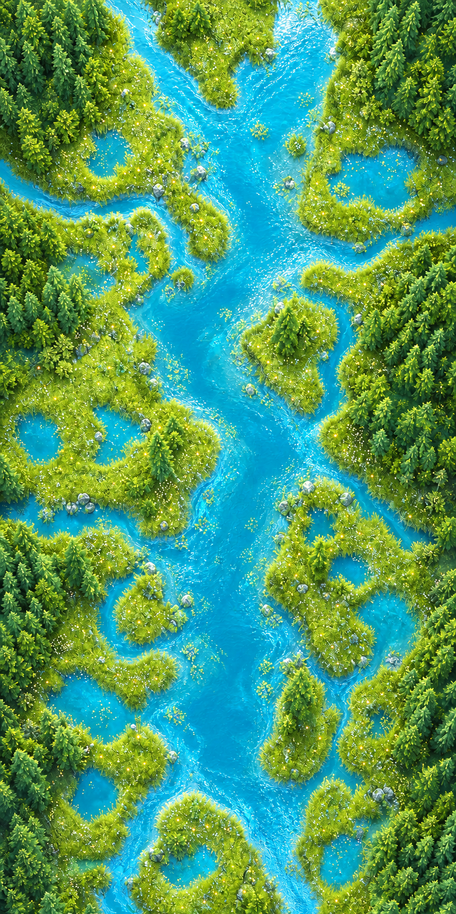

# 雷霆突击 · 第一关

一款使用 Three.js 制作的 3D 纵向卷轴飞行射击游戏。驾驶 XF-27 战机穿越晴空湿地与海岸防线，拾取特殊武器，突破敌机编队并击败重型空中母舰 Boss。

## 游戏特色

- Three.js 实时 3D 场景、动态光照、阴影、雾效与 Bloom 辉光
- 明亮的河流、湖泊、森林岛屿场景，并包含鸟群、鱼群和环境动态元素
- 主炮自动连续射击，投放炸弹时不会中断炮火
- 闪电、激光、散花弹三种随机掉落的特殊武器，支持三级强化
- 白色核弹编队大招、全屏清弹、核爆闪光、冲击环与蘑菇云效果
- 多种敌机编队与留有躲避通道的弹幕设计
- 第一关机械重型飞机 Boss，拥有阶段化攻击模式
- 键盘、鼠标拖动和移动端虚拟摇杆操作
- 分数、击毁数、评级、生命、炸弹、关卡进度及本地最高分记录

## 场景预览



## 快速开始

环境要求：Node.js `20.19+` 或 `22.12+`。

```bash
npm install
npm run dev
```

启动后打开终端显示的本地地址，通常为：

```text
http://localhost:5173/
```

## 操作方式

| 操作 | 键盘 / 鼠标 | 移动端 |
| --- | --- | --- |
| 移动战机 | `WASD`、方向键或在画面中拖动 | 左侧虚拟摇杆 |
| 主炮 | 自动开火 | 自动开火，亦可按住 `FIRE` |
| 投放核弹 | `X` 或 `K` | `BOMB` 按钮 |
| 暂停 / 继续 | `P` | 暂停界面按钮 |
| 开始 / 重新挑战 | `Enter` 或界面按钮 | 界面按钮 |

> 主武器会自动射击，不需要持续按空格键。核弹与主炮是独立系统，投弹期间主炮仍会继续攻击。

## 武器系统

| 武器 | 效果 |
| --- | --- |
| VULCAN | 默认高速机炮，升级后增加弹道数量与射速 |
| LIGHTNING | 粗壮的多分支闪电，可自动连接多个目标 |
| LASER | 高速贯穿激光，对直线上的敌机持续造成伤害 |
| BLOSSOM | 扇形散花弹，适合清理大范围敌机 |
| MISSILE | 核弹大招，清除敌方子弹并对全屏敌人与 Boss 造成重击 |

敌机被摧毁后有概率掉落特殊武器；连续拾取同一种武器可以将其提升至最高三级。部分击毁奖励还会补充核弹库存。

## 游戏流程

1. 穿越持续滚动的湿地与海岸战场。
2. 躲避敌机和弹幕，通过突破口保持生存。
3. 击毁敌机并拾取随机武器强化。
4. 在危急时使用核弹清理弹幕和大范围敌人。
5. 迎战第一关 Boss，摧毁重型空中母舰并获得任务评级。

## 构建与预览

```bash
# 构建生产版本
npm run build

# 本地预览生产构建
npm run preview
```

构建产物会生成在 `dist/` 目录中。

## 开发调试入口

项目提供了便于视觉验收的查询参数：

```text
/?qa=boss
/?weapon=lightning
/?weapon=laser
/?weapon=spread
/?qa=boss&weapon=lightning
```

- `qa=boss`：快速进入低血量 Boss 验收模式。
- `weapon=...`：以三级指定特殊武器开始游戏。
- 普通游戏不携带这些参数，关卡时长与 Boss 血量保持完整设定。

## 项目结构

```text
.
├── index.html                      # HUD、菜单和移动端控制界面
├── public/
│   └── assets/                     # 湿地背景与场景素材
├── src/
│   ├── main.js                     # Three.js 场景、对象、战斗和关卡逻辑
│   └── style.css                   # HUD、菜单、特效与响应式样式
├── package.json                    # 依赖与运行脚本
└── README.md
```

## 技术栈

- [Three.js](https://threejs.org/)：3D 场景、模型、材质、光照和粒子效果
- Three.js EffectComposer / UnrealBloomPass：后期辉光
- [Vite](https://vite.dev/)：开发服务器与生产构建
- 原生 JavaScript、HTML 与 CSS

## 浏览器支持

建议使用支持 WebGL 2 的较新版本 Chrome、Edge、Firefox 或 Safari。为了获得稳定帧率，游戏会将渲染像素比限制在设备像素比 `2` 以内。

